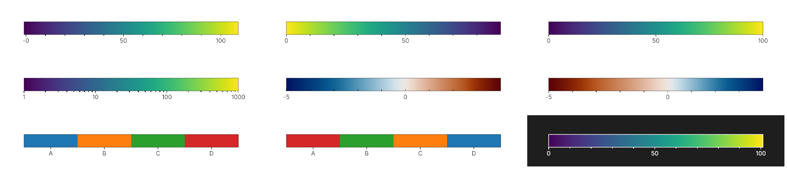
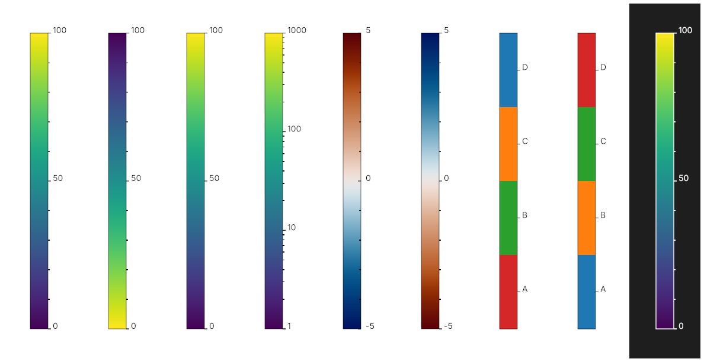
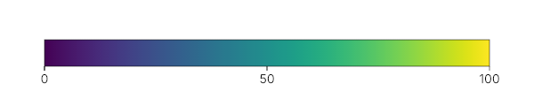

# scibar
colorbars for the masses, in c++


<!-- badges: start -->
  [](https://github.com/dfsp-spirit/scibar/actions)
  [](https://github.com/dfsp-spirit/scibar/actions)
  [](https://dfsp-spirit.github.io/scibar/)
<!-- badges: end -->


## About

**scibar** is a lightweight, header-only C++17 library for rendering publication-ready colorbars to both vector and raster outputs. Built for scientific visualization, it provides rich support for diverse colorbar types alongside extensive customization over layouts, ticks, labels, and palettes—giving you full control over how your data scale is displayed.

While **scibar** was designed as the companion colorbar engine for [scimesh](https://github.com/dfsp-spirit/scimesh), it is completely standalone and engine-agnostic, ready to integrate into any C++ visualization pipeline.







## Features

- **Four scale types** — Linear, logarithmic, diverging, and categorical (qualitative) data scales
- **Built-in colormaps** — viridis (sequential) and vik (diverging), plus custom `std::vector<Color>` colormaps
- **Vector & raster output** — clean SVG with linear gradients, plus PPM (zero-dependency) and PNG (via stb)
- **Horizontal & vertical** — both orientations with independent layout control
- **Auto-generated ticks** — smart major and minor tick generation with configurable precision, plus custom tick labels
- **Colormap direction** — independently toggle axis inversion and colormap reversal
- **Light & dark themes** — `Style::defaultLight()` and `Style::defaultDark()`, fully customizable
- **Embedded font** — Inter Regular baked in, zero-config; drop in any `.ttf` for custom fonts
- **Three API levels** — zero-friction `exportColorbar()` for one-call export, `drawLegend()` for rapid prototyping, low-level `drawColorBar`/`drawTicks`/`drawLabel` for full control
- **Tick styling** — inward/outward ticks, sub-ticks on/off, configurable lengths


## What scibar is not

**scibar is not a layout engine.**

Rather than forcing a full layout framework on you, we offer three API levels:

- **Zero-friction:** `exportColorbar()` — one call: choose a colormap, pick a filename, done. Auto-detects format from extension (`.ppm`, `.png`, `.svg`).
- **High-level:** `drawLegend()` (raster) / `exportLegendToSVG()` (vector) — single call, auto-layout, sensible defaults, full control over the canvas buffer.
- **Low-level:** `drawColorBar()` / `drawTicks()` / `drawSubTicks()` / `drawLabel()` (raster) and `exportToSVG()` (vector) — full manual control over placement and geometry.


## Documentation

- [API Reference](https://dfsp-spirit.github.io/scibar/) — Doxygen-generated API docs
- [API Overview](docs/API_OVERVIEW.md) — high-level vs low-level, raster vs vector function reference
- [Getting Started Guide](docs/GETTING_STARTED.md) — quick start and core concepts
- [FAQ](docs/FAQ.md) — common questions about colormap direction, ticks, layout, and more


## Quick Start


```c++
#define SCIBAR_IMPLEMENTATION
#include "scibar/scibar.hpp"

int main() {
    using namespace scibar;

    std::vector<Color> cmap = util::viridis();  // store locally — ColorMapView is non-owning
    ExportOpts opts;
    opts.scale    = {ScaleType::Linear, 0.0f, 100.0f};  // data from 0 to 100
    opts.label    = "Temperature (°C)";
    opts.colormap = cmap;  // non-owning view — cmap must outlive the export call

    // One call: auto-detects format from extension (.ppm / .png / .svg)
    exportColorbar(opts, "colorbar.png");

    return 0;
}
```



See [here](./examples/minimal_zerofriction/) for the runnable example program to generate this image.


## Acknowledgements


Thanks heaps to the authors of these great software packages that scibar is built upon:

* `src/third_party/canvas_ity.hpp`: [canvas_ity](https://github.com/a-e-k/canvas_ity) by Andrew Kensler
* `cpp_tests/catch_amalgamated.{h,cpp}`: [catchorg/Catch2](https://github.com/catchorg/Catch2/tree/devel/extras) — C++ test framework by Martin Hořeňovský
* `src/third_party/stb_image.h`, `src/third_party/stb_image_write.h`, `src/third_party/stb_truetype.h`: [nothings/stb](https://github.com/nothings/stb) — image loading/saving + truetype, maintained by Sean Barrett
* the `vik` diverging colormap by Fabio Crameri, https://www.fabiocrameri.ch/colourmaps/ (embedded in code)
* the `viridis` colormap by Stéfan van der Walt and Nathaniel Smith, (embedded in code) [reference (.bib)](./web/references/smith2015viridis.bib).
* the embedded **Inter** font by Rasmus Andersson, https://rsms.me/inter/ — SIL Open Font License

And of course, thanks to the authors of the dependencies of these packages, and their dependencies...

Our [full example applications](./examples/) use these additional tools:

* the `batlow` colormap by Fabio Crameri, https://www.fabiocrameri.ch/colourmaps/
* the toml++ header only library by Mark Gillard, https://github.com/marzer/tomlplusplus
* the **Libertinus Serif** font (used in the `examples/custom_font/` example, not part of the library) by Philipp H. Poll and the Libertinus project, https://github.com/alerque/libertinus — SIL Open Font License


Once more, thank you!


## Developer Information

Please see [README_DEVELOPMENT.md](./README_DEVELOPMENT.md).


## Author & License

* License: [MIT](./LICENSE)
* Author: [Tim Schäfer](https://ts.rcmd.org)


